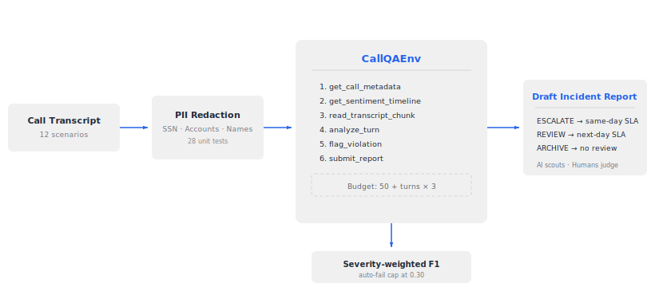

# RegTriage — Financial Services Regulatory Compliance Auditor

> **We are solving billion-dollar compliance risks, not checking if the agent smiled through the phone.**

RegTriage is an OpenEnv RL environment that trains agents to audit financial services call transcripts for **CFPB, TCPA, and GDPR/CCPA violations**. It solves the **100% Coverage Problem**: human QA supervisors audit 1–3% of calls; RegTriage covers the other 97% with **Draft Incident Reports** for human supervisor sign-off. Baselines published, training loop in progress.

[](https://huggingface.co/spaces/ree2raz/RegTriage-OpenEnv)
[]()

| | |
|---|---|
| **Tasks** | 12 |
| **Violation Types** | 6 |
| **Difficulty Tiers** | 3 |

**Highlights**
- Compute budget forces triage strategy over brute-force
- Severity-weighted F1 grading with auto-fail cap
- Hero Agent trap — Gemma 4 31B scores 0.918, proving model capability gaps shrink fast
- Draft Incident Reports: ESCALATE / REVIEW / ARCHIVE

---

## Why This Environment Exists

| What | Details |
|---|---|
| **Domain** | Financial services contact center compliance (CFPB, TCPA, GDPR/CCPA) |
| **Real-world task** | QA supervisor auditing call transcripts for regulatory violations and revenue leakage |
| **Why it matters** | 10,000-seat center → 2M calls/month → 97% never reviewed → $3.6B/yr in industry penalties |
| **Why not just prompt an LLM** | Scale cost (compute budget forces triage), deterministic grading (F1 not opinions), on-premise training (Dockerized Gymnasium) |
| **Output paradigm** | Draft Incident Report with ESCALATE/REVIEW/ARCHIVE action — human makes final call |

---

## Evaluation Criteria Mapping

How RegTriage addresses each judging dimension:

| Criterion | Weight | How We Meet It |
|---|---|---|
| **Real-world utility** | 30% | CFPB/TCPA violations are documented regulatory risks. Transcripts model real call center scenarios. QA supervisors do this exact job daily. |
| **Task & grader quality** | 25% | 12 tasks (4 easy/4 medium/4 hard) with deterministic programmatic graders. Severity-weighted F1, auto-fail cap, scores in [0, 1]. |
| **Environment design** | 20% | Budget-driven action space (6 tools), PII redaction pipeline, stateful WebSocket + stateless HTTP, clean episode boundaries. |
| **Code quality & spec compliance** | 15% | `openenv validate` passes. Uses `create_app()`, standard base types, canonical Dockerfile. No custom HTTP handlers. |
| **Creativity & novelty** | 10% | Contact center compliance is a novel domain for OpenEnv. Compute-budget-as-triage-signal is non-obvious. |

---

## Violation Taxonomy (6 Types)

We deliberately target violations that trigger **lawsuits and P&L damage** — not soft metrics.

| Type | Category | Severity | What It Catches |
|---|---|---|---|
| `regulatory_disclosure_failure` | Legal | HIGH | Missing recording disclaimer → CFPB investigation |
| `failed_escalation` | Legal | HIGH | Deflecting supervisor request → CFPB complaint |
| `pii_exposure_risk` | Legal | HIGH/MED | Requesting full SSN when last 4 suffice → GDPR/CCPA |
| `unauthorized_commitment` | Revenue | HIGH/MED | Promising rate without authority → binding verbal contract |
| `churn_save_policy_breach` | Revenue | HIGH/MED | Inventing retention discount → direct margin erosion |
| `incorrect_hold_procedure` | Operational | MED/LOW | Silent hold without permission → TCPA violation |

**Design choice — the Hero Agent trap:** `churn_save_policy_breach` ≠ `unauthorized_commitment`. One is a P&L leak (company loses money), the other is a legal liability (company gets sued). Our baseline model cannot distinguish them — that's the RL training signal.

---

## Action & Observation Spaces

### AuditAction (Action Space)

The agent chooses one of 7 tools per step:

| Field | Type | Description |
|---|---|---|
| `action_type` | string | Which tool: `get_call_metadata`, `get_sentiment_timeline`, `get_transcript_length`, `read_transcript_chunk`, `analyze_turn`, `flag_violation`, `submit_report` |
| `turn_index` | int? | Target turn for `analyze_turn` or `flag_violation` |
| `start_turn` | int? | Start of range for `read_transcript_chunk` |
| `end_turn` | int? | End of range for `read_transcript_chunk` (max 5 turns from start) |
| `violation_type` | string? | Category for `flag_violation` (see 6 types above) |
| `violation_severity` | string? | `high`, `medium`, or `low` |
| `compliance_pass` | bool? | Agent's verdict for `submit_report` |
| `policy_hypothesis` | string? | Policy to check for `analyze_turn` (returns full rubric) |

### AuditObservation (Observation Space)

| Field | Type | Description |
|---|---|---|
| `result` | any | Tool-specific return data |
| `checklist` | dict | Audit progress: metadata_reviewed, sentiment_checked, transcript_chunks_read, turns_analyzed, violations_flagged, report_submitted, budget_remaining_pct |
| `system_feedback` | str | Human-readable guidance or error message |

### AuditState (State Space)

| Field | Type | Description |
|---|---|---|
| `episode_id` | str | Unique episode identifier |
| `difficulty` | str | easy / medium / hard |
| `step_count` | int | Actions taken this episode |
| `total_budget` | int | Compute budget available at start |
| `budget_remaining` | int | Compute budget left |
| `actions_taken` | list[str] | Action history |
| `flagged_violations` | list[dict] | Violations recorded so far |
| `done` | bool | Episode complete |
| `cumulative_reward` | float | Reward accumulated so far |

---

## Tasks (12 Transcripts, 3 Tiers)

Every violation type appears 3–5× across tasks (23 total violations). 2 clean calls test false-positive discipline.

### Easy (4 tasks)
| Task | Violations | Description |
|---|---|---|
| call_001 | 1 (regulatory_disclosure_failure) | Short inquiry call, agent forgets opening disclaimer |
| call_003 | 1 (failed_escalation) | Frustrated customer asks for supervisor, agent deflects |
| call_013 | 1 (pii_exposure_risk) | Agent requests full SSN instead of last 4 digits |
| call_014 | 0 (clean) | Well-handled call, no violations — tests false-positive discipline |

### Medium (4 tasks)
| Task | Violations | Description |
|---|---|---|
| call_005 | 2 (failed_escalation + unauthorized_commitment) | Angry customer + agent promises refund without authorization |
| call_006 | 2 (regulatory_disclosure_failure + incorrect_hold_procedure) | Missing disclaimer + silent hold without permission |
| call_007 | 2 (pii_exposure_risk + churn_save_policy_breach) | Full SSN request + unauthorized discount offer |
| call_008 | 2 (unauthorized_commitment + incorrect_hold_procedure) | Rate guarantee + unannounced hold |

### Hard (4 tasks)
| Task | Violations | Description |
|---|---|---|
| call_009 | 3 (all categories) | Buried disclaimer, failed escalation, unauthorized commitment |
| call_010 | 4 (all categories + sentiment misdirection) | Customer seems calm but is actually dissatisfied; agent misses escalation |
| call_011 | 3 (regulatory_disclosure_failure + churn_save_policy_breach + unauthorized_commitment) | Hero Agent: customer happy, agent broke policy |
| call_012 | 3 (pii_exposure_risk + incorrect_hold_procedure + failed_escalation) | Multi-violation, customer anger escalates silently |

---

## Environment Design

### Compute Budget

```
Budget = 50 + (total_turns × 3)
```

A 10-turn easy call gets 80 budget. A 30-turn hard call gets 140. Reading is priced per-turn — reading 2 targeted turns costs 6, reading 15 turns costs 45. This forces **triage strategy** over brute-force, matching how expert human QA supervisors allocate time.

### Reward Shaping

| Signal | Value | When |
|---|---|---|
| Metadata/sentiment | +0.05 | Trajectory reward for triage actions |
| Read/analyze | +0.02 | Incremental for information gathering |
| Flag violation | 0.00 | Deferred to final grader |
| Invalid action | −0.02 to −0.05 | OOB range, bad params |
| **Final grade** | 0.0–1.0 | Severity-weighted F1 on submit_report |

### Grading Formula

| Component | Weight |
|---|---|
| Compliance verdict (pass/fail correct?) | 0.20 |
| Violation F1 (severity-weighted: high=3×, med=2×, low=1×) | 0.60 |
| Efficiency bonus (budget_remaining / total_budget) | 0.20 |
| Severity calibration bonus | +0.02 per exact match |
| False positive penalty | −0.03 to −0.10 per FP |
| **Auto-fail cap** | Score ≤ 0.30 if all HIGH violations missed |

**Type-only matching**: Violations match by category, not turn index. Multi-turn violations (e.g., escalation failures spanning turns 8–14) get credit regardless of which turn the agent points to.

---

## Architecture

```
Call Transcript → PII Redaction → CallQAEnv → Draft Incident Report
```

**Flow:**
1. **Call Transcript** (12 scenarios) enters the pipeline
2. **PII Redaction** scrubs SSN, accounts, names (28 unit tests)
3. **CallQAEnv** exposes 7 tools: `get_call_metadata`, `get_sentiment_timeline`, `get_transcript_length`, `read_transcript_chunk`, `analyze_turn`, `flag_violation`, `submit_report`
4. **Budget enforcement**: `50 + (total_turns × 3)` — forces triage over brute-force
5. **Severity-weighted F1 grading** with auto-fail cap at 0.30
6. **Draft Incident Report** routes to ESCALATE / REVIEW / ARCHIVE for human sign-off

### System Architecture



---

## OpenEnv Compliance

This environment follows the **OpenEnv specification** exactly:

```yaml
# openenv.yaml — standard 6-line manifest
spec_version: 1
name: regtriage
type: space
runtime: fastapi
app: regtriage_openenv.server.app:app
port: 8000
```

**Architecture**:
- `CallQAEnv` extends `Environment[AuditAction, AuditObservation, AuditState]`
- Server uses `create_app()` from `openenv.core.env_server` (no custom HTTP handlers)
- Dockerfile uses `ghcr.io/meta-pytorch/openenv-base:latest` (canonical base image)
- Pydantic models inherit from `Action`, `Observation`, `State` base types

**API Endpoints** (auto-generated by `create_app`):
- `POST /reset` — Reset environment (stateless HTTP)
- `POST /step` — Execute action (stateless HTTP, wrapped in `{"action": {...}}`)
- `GET /state` — Get current state
- `GET /health` — Health check
- `GET /schema` — Action/Observation/State JSON schemas
- `WS /ws` — **Stateful WebSocket** for multi-step episodes

> **Note on HTTP vs WebSocket**: The HTTP `/reset` and `/step` endpoints are **stateless** — each call creates a fresh environment instance. For multi-step episodes with persistent state, use the WebSocket endpoint (`/ws`) or the OpenEnv `EnvClient` class which handles session management automatically.

---

## Inference Output Format

The `inference.py` script emits structured logs to stdout matching the hackathon specification:

```
[START] task=call_001 env=regtriage model=<your-model>
[STEP] step=1 action=get_call_metadata() reward=0.05 done=false error=null
[STEP] step=2 action=get_sentiment_timeline() reward=0.05 done=false error=null
[STEP] step=3 action=read_transcript_chunk(start_turn=0,end_turn=2) reward=0.02 done=false error=null
[STEP] step=4 action=flag_violation(violation_type=regulatory_disclosure_failure,violation_severity=high) reward=0.00 done=false error=null
[STEP] step=5 action=submit_report(compliance_pass=false) reward=0.93 done=true error=null
[END] success=true steps=5 score=0.936 rewards=0.05,0.05,0.02,0.00,0.93
```

Rules: `reward` and `rewards` formatted to 2 decimal places. `done` and `success` are lowercase booleans. `error` is the raw string or `null`.

---

## Baseline Scores

Multi-model baseline results are maintained in the [`baseline_results_multi/`](./baseline_results_multi/) directory. The environment grading is deterministic — a stronger model scores higher.

> **Hero Agent trap**: Gemma 4 31B scores 0.918, proving model capability gaps shrink fast.

---

## Quick Start

### Pre-Submission Checklist

Run these before resubmitting:

```bash
# 1. Verify HF Space is live
curl -s -o /dev/null -w "%{http_code}" -X POST \
  -H "Content-Type: application/json" -d '{}' \
  https://ree2raz-regtriage-openenv.hf.space/reset
# Expected: 200

# 2. Run openenv validate (requires: pip install openenv-core)
openenv validate .
# Expected: [OK] : Ready for multi-mode deployment

# 3. Build Docker image locally
docker build -t regtriage:test .
# Expected: build succeeds with no errors

# 4. WebSocket integration test (requires: pip install websockets)
python3 test_ws.py --task call_001
# Expected: full episode completes, score > 0.5
```

### Local Development

```bash
# Install dependencies
uv sync

# Run smoke tests
uv run python -c "from regtriage_openenv import CallQAEnv; env = CallQAEnv(); print('OK')"

# Run full inference (requires HF_TOKEN set in .env or environment)
export HF_TOKEN=your_token_here
uv run python inference.py

# Validate OpenEnv compliance
uv run openenv validate .
```

### Docker Build & Run

```bash
# Build
docker build -t regtriage:latest .

# Run locally (port 8000)
docker run -p 8000:8000 regtriage:latest

# Test health
curl http://localhost:8000/health
```

### WebSocket Test (stateful episodes)

```bash
# Install websockets
pip install websockets

# Run interactive test
python3 test_ws.py --task call_001
```

Or manually with `websocat`:
```bash
websocat wss://ree2raz-regtriage-openenv.hf.space/ws
# Then send: {"type": "reset", "data": {"task_id": "call_001"}}
```

### Environment Variables

| Variable | Default | Required |
|---|---|---|
| `HF_TOKEN` | — | Yes (for inference.py) |
| `API_BASE_URL` | `https://router.huggingface.co/v1` | No |
| `MODEL_NAME` | — | No |

---

## Hardware Constraints

Your solution runs inside a Docker container with:
- **2 vCPU**
- **8 GB RAM**
- **No GPU required** — environment is CPU-only, LLM inference uses external API

---

## Repository Structure

```
├── regtriage_openenv/
│   ├── __init__.py           # Package exports
│   ├── environment.py        # CallQAEnv (extends Environment ABC)
│   ├── models.py             # Pydantic: AuditAction, AuditObservation, AuditState
│   ├── grading.py            # Severity-weighted F1, auto-fail logic
│   ├── redact.py             # PII redaction pipeline (28 tests)
│   ├── server/
│   │   └── app.py            # FastAPI via create_app()
│   └── tasks.yaml            # Task definitions
├── inference.py              # Baseline LLM agent ([START]/[STEP]/[END] output)
├── transcripts.json          # 12 GPT-4o transcripts with ground truth
├── openenv.yaml              # Standard 6-line OpenEnv manifest
├── Dockerfile                # Uses ghcr.io/meta-pytorch/openenv-base
├── pyproject.toml            # Dependencies (uv managed)
└── tests/
    └── test_redact.py        # 28 unit tests for PII redaction
```

---

## Key Design Decisions

1. **Compute budget, not step limits** — Budget scales with transcript length. Per-turn read pricing teaches agents precision over brute-force.

2. **Severity-weighted F1** — Missing a HIGH violation costs 3× more than missing a LOW. Mirrors real QA rubrics where regulatory breaches are career-ending.

3. **Auto-fail cap at 0.30** — Miss every HIGH violation? Score capped regardless of other work. Models the reality that a "clean" audit that misses a CFPB violation is worthless.

4. **Hero Agent anti-pattern** — Transcripts where the human agent broke policy but the customer left happy. Tests whether the AI auditor optimizes for customer satisfaction (wrong) or compliance (right).

5. **PII redaction pipeline** — SSN, account numbers, names redacted before agent sees data. 28 unit tests. The `pii_exposure_risk` violation tests whether the human agent *requested* excessive PII, not whether PII exists in text.

6. **Draft Incident Report** — Output is actionable intelligence for human supervisors, not a score card. ESCALATE/REVIEW/ARCHIVE routing with efficiency metrics.

7. **OpenEnv-native architecture** — Uses `create_app()`, standard base types, canonical Dockerfile pattern. No custom HTTP handlers or fallback code paths.

---

## Draft Incident Report Output

```json
{
  "verdict": "FAIL",
  "agent_verdict_correct": true,
  "recommended_action": "ESCALATE",
  "triage_efficiency_pct": 62,
  "estimated_human_review_minutes": 11,
  "findings": [
    {"finding": "Regulatory Disclosure Failure", "severity": "HIGH", "status": "DETECTED"},
    {"finding": "Failed Escalation", "severity": "HIGH", "status": "DETECTED"}
  ]
}
```

The agent is a **scout, not a judge**. ESCALATE/REVIEW/ARCHIVE triage routes reports to the right human queue. The estimated review time tells supervisors how much effort the AI just saved.

---

Apache 2.0 · Built for the [Meta PyTorch OpenEnv Hackathon](https://www.scaler.com/school-of-technology/meta-pytorch-hackathon)
